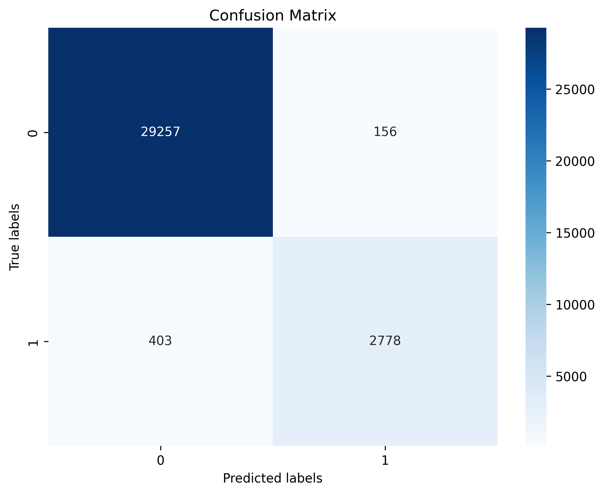
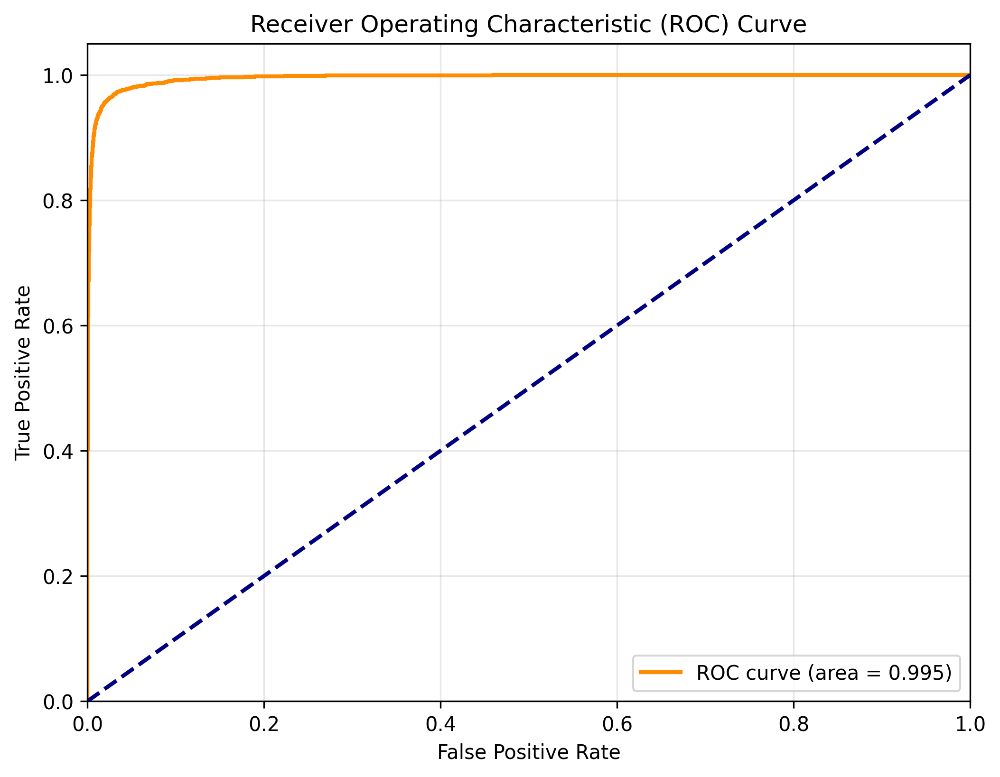
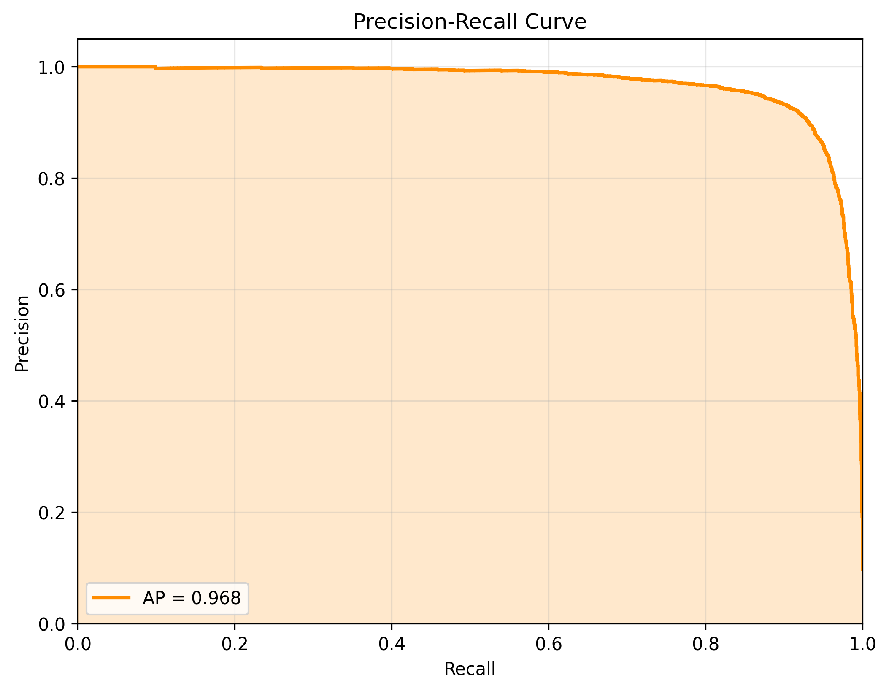
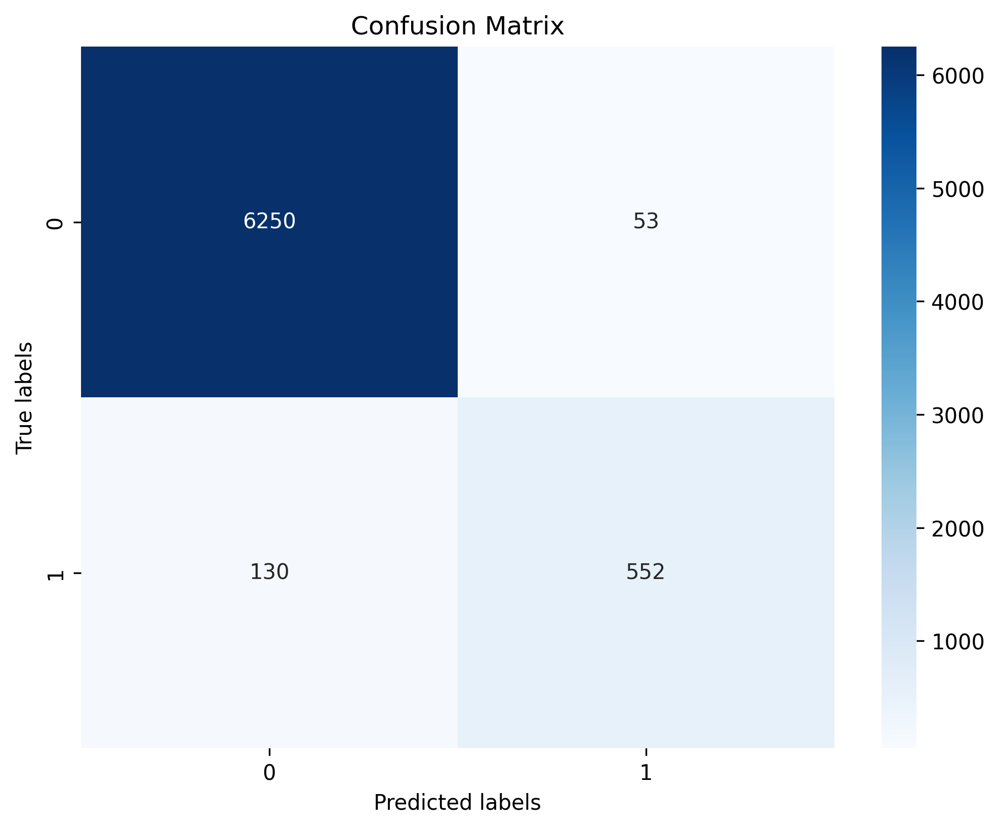
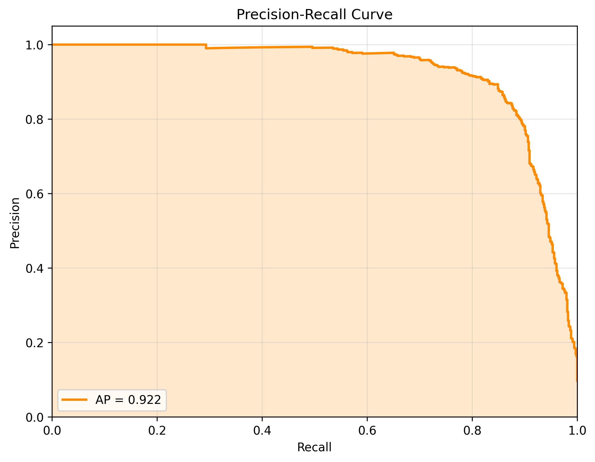
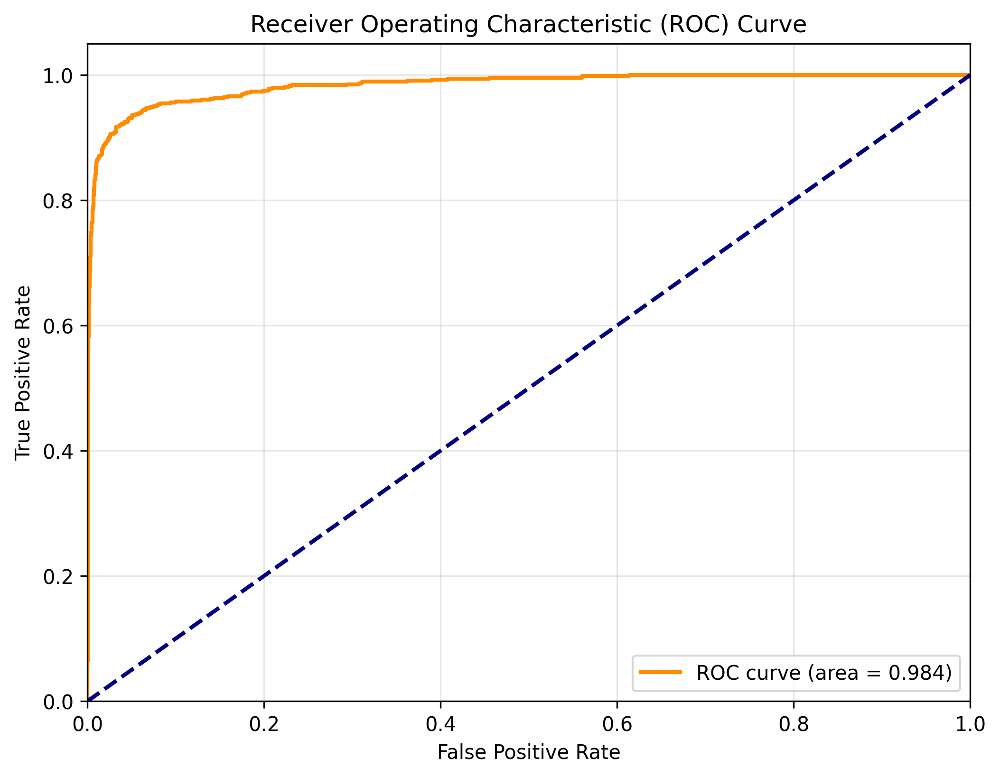
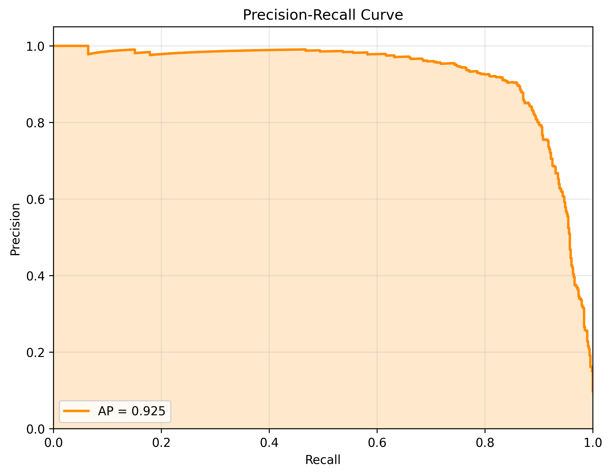

# Evaluation Report for gat

## Summary

| Metric | Train | Validation | Test |
|--------|-------|------------|------|
| accuracy | 0.9828 | 0.9738 | 0.9749 |
| weighted avg_f1-score | 0.9825 | 0.9731 | 0.9743 |
| weighted avg_precision | 0.9825 | 0.9731 | 0.9743 |
| weighted avg_recall | 0.9828 | 0.9738 | 0.9749 |
| roc_auc | 0.9953 | 0.9815 | 0.9835 |
| pr_auc | 0.9684 | 0.9224 | 0.9248 |

## Class-specific Metrics (Test Set)

| Class | Precision | Recall | F1-Score | Support |
|-------|-----------|--------|----------|--------|
| 0 | 0.9801 | 0.9924 | 0.9862 | 6303.0 |
| 1 | 0.9204 | 0.8138 | 0.8638 | 682.0 |

## Detailed Metrics

### Train Set

#### Confusion Matrix

#### ROC Curve

#### Precision-Recall Curve

### Val Set

#### Confusion Matrix

#### ROC Curve

#### Precision-Recall Curve

### Test Set

#### Confusion Matrix

#### ROC Curve

#### Precision-Recall Curve

