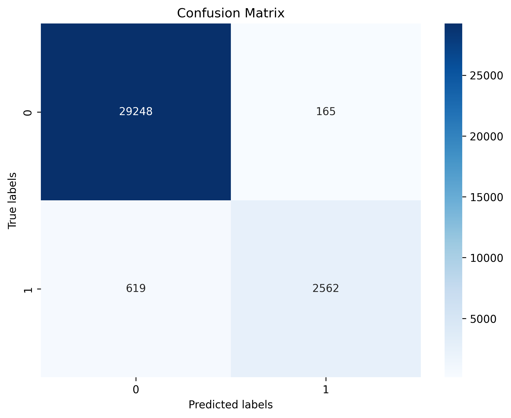
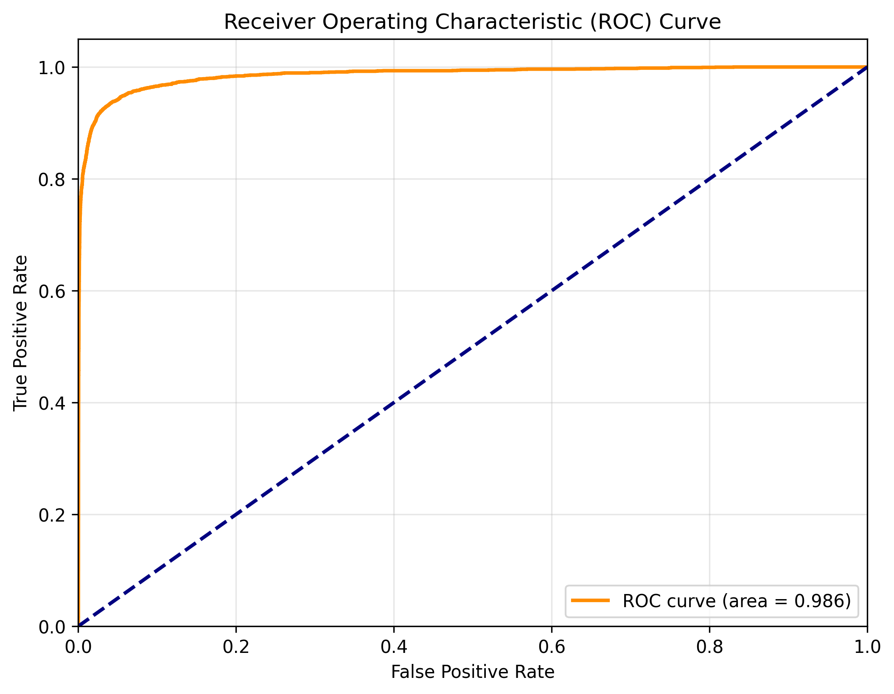
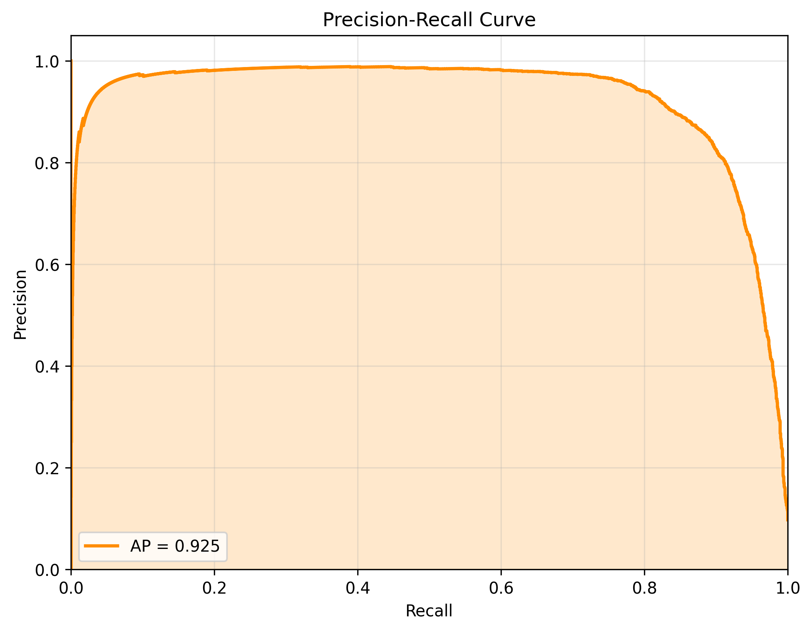
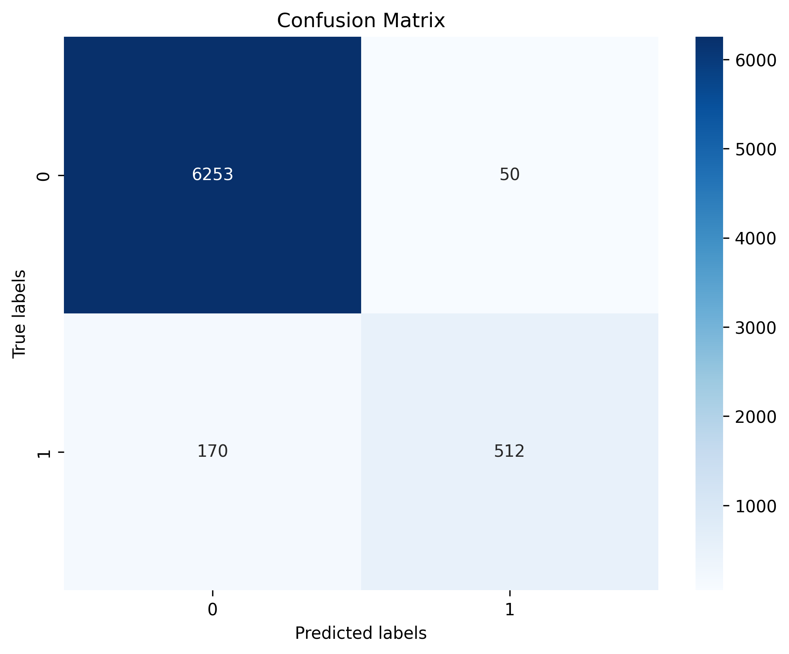
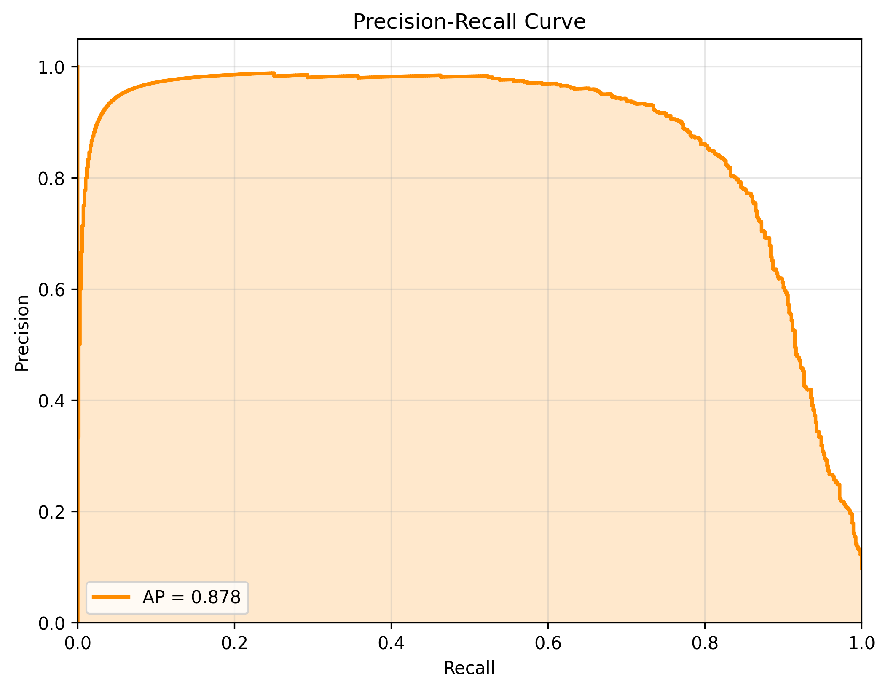
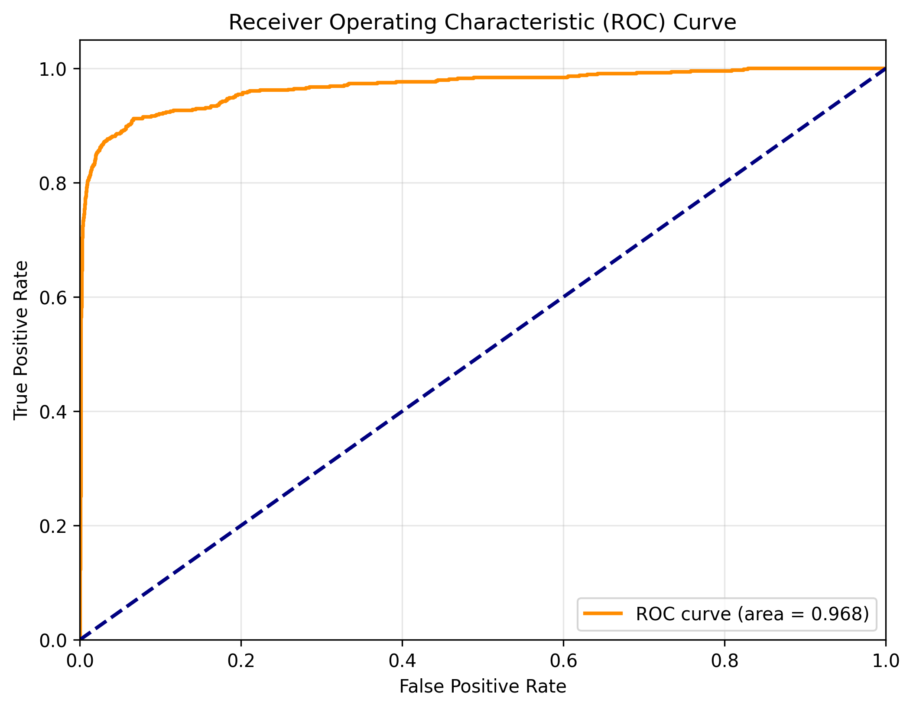
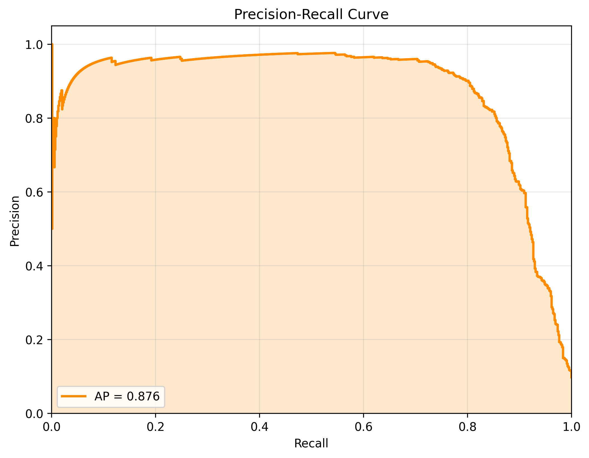

# Evaluation Report for gcn

## Summary

| Metric | Train | Validation | Test |
|--------|-------|------------|------|
| accuracy | 0.9759 | 0.9685 | 0.9711 |
| weighted avg_f1-score | 0.9751 | 0.9671 | 0.9700 |
| weighted avg_precision | 0.9754 | 0.9674 | 0.9702 |
| weighted avg_recall | 0.9759 | 0.9685 | 0.9711 |
| roc_auc | 0.9857 | 0.9688 | 0.9679 |
| pr_auc | 0.9250 | 0.8779 | 0.8759 |

## Class-specific Metrics (Test Set)

| Class | Precision | Recall | F1-Score | Support |
|-------|-----------|--------|----------|--------|
| 0 | 0.9760 | 0.9924 | 0.9841 | 6303.0 |
| 1 | 0.9167 | 0.7742 | 0.8394 | 682.0 |

## Detailed Metrics

### Train Set

#### Confusion Matrix

#### ROC Curve

#### Precision-Recall Curve

### Val Set

#### Confusion Matrix

#### ROC Curve

#### Precision-Recall Curve

### Test Set

#### Confusion Matrix

#### ROC Curve

#### Precision-Recall Curve

