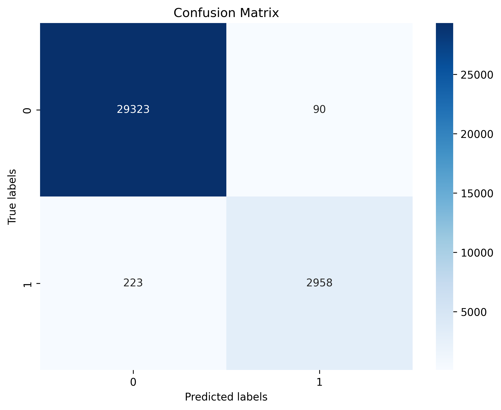
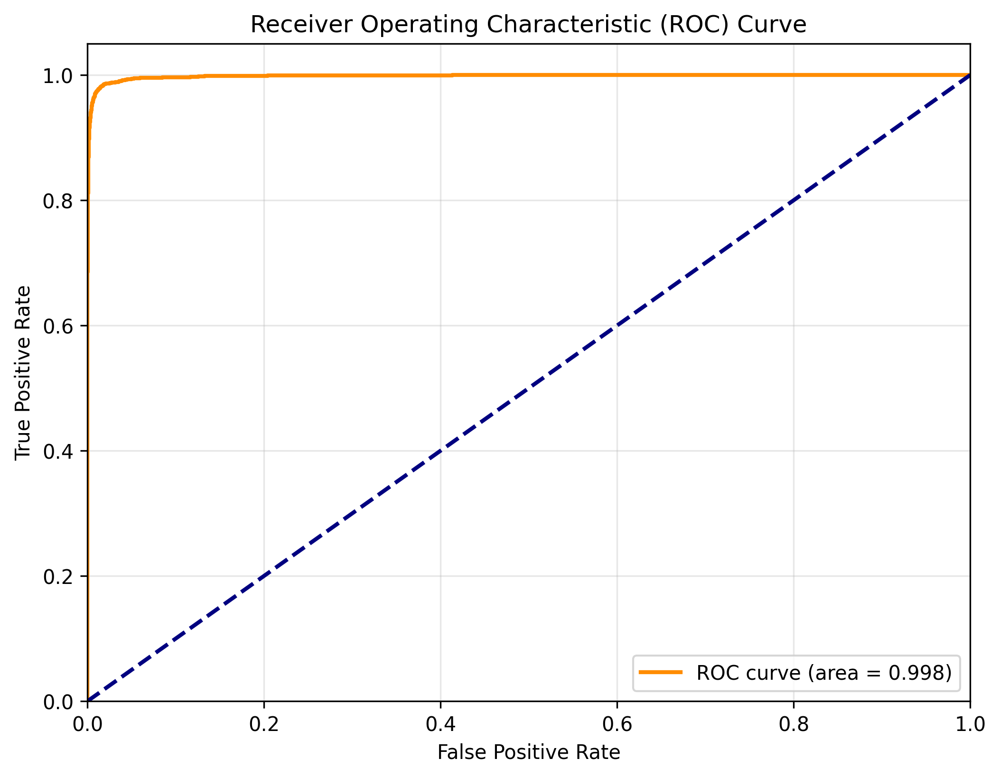
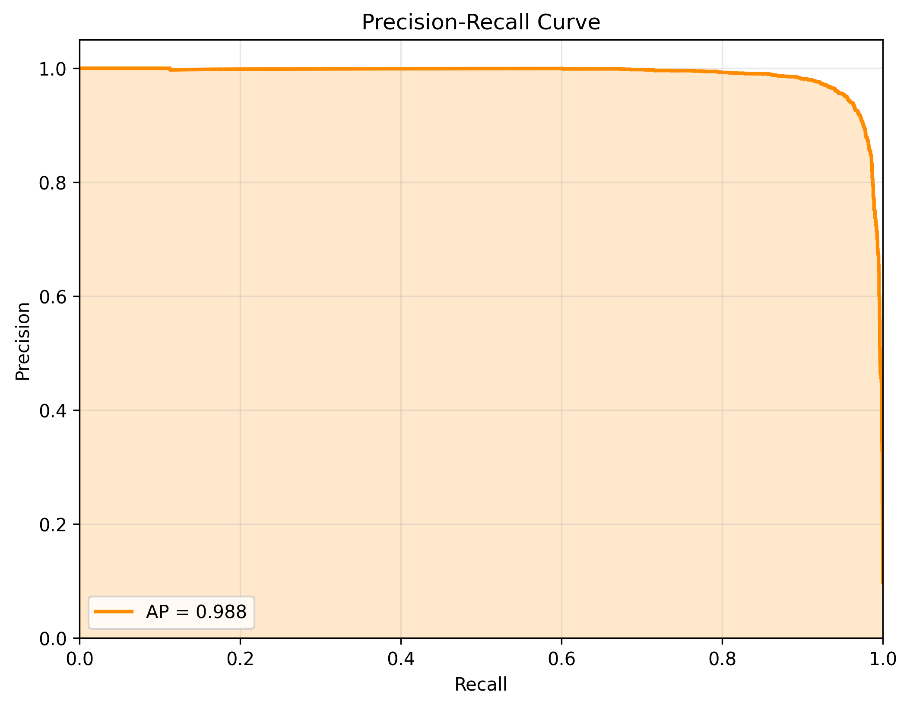
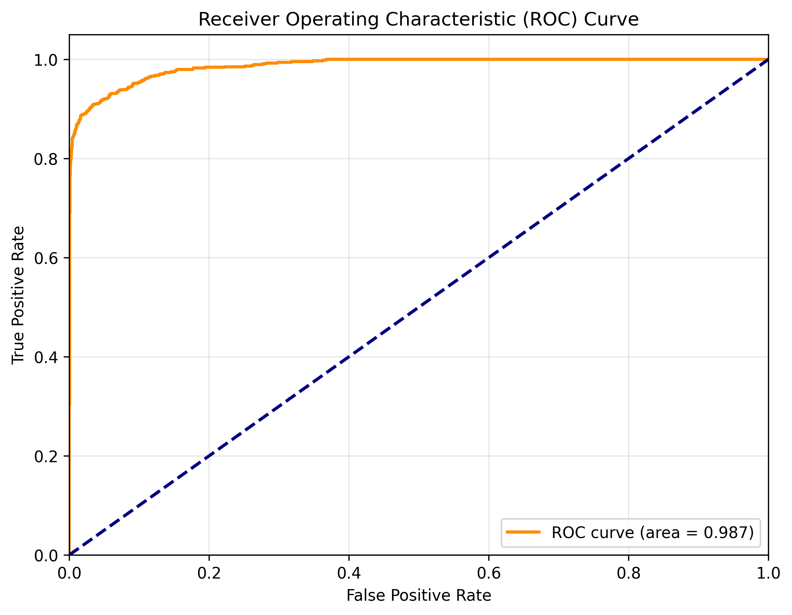
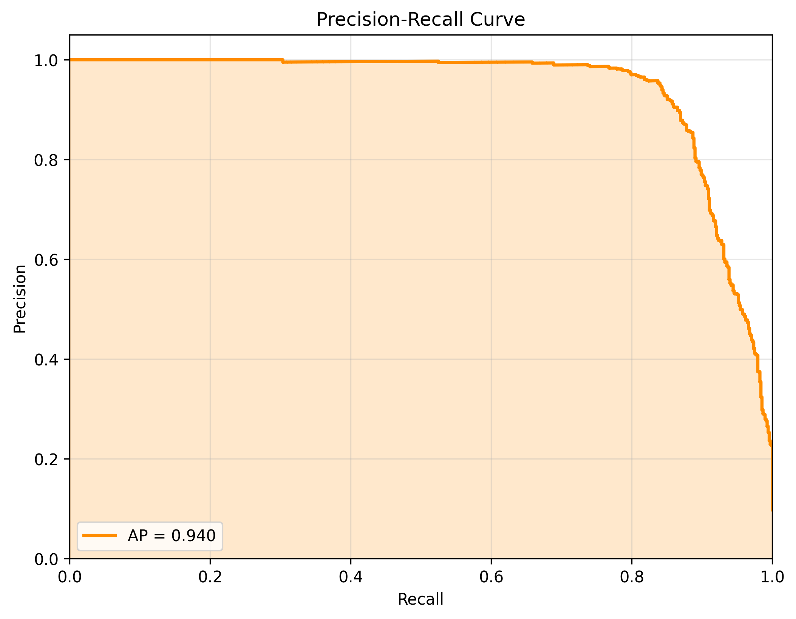
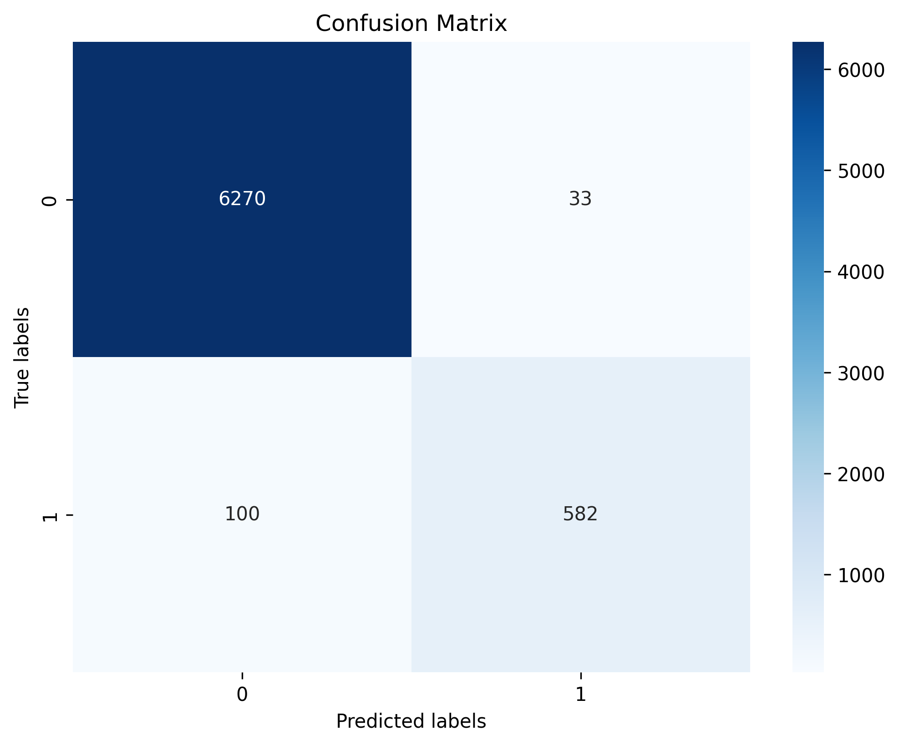
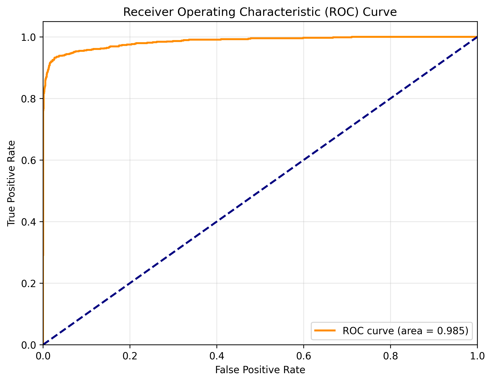
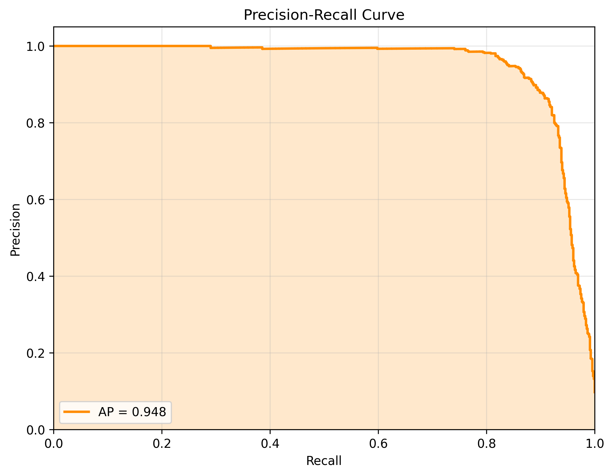

# Evaluation Report for sage

## Summary

| Metric | Train | Validation | Test |
|--------|-------|------------|------|
| accuracy | 0.9904 | 0.9800 | 0.9810 |
| weighted avg_f1-score | 0.9903 | 0.9794 | 0.9805 |
| weighted avg_precision | 0.9903 | 0.9796 | 0.9806 |
| weighted avg_recall | 0.9904 | 0.9800 | 0.9810 |
| roc_auc | 0.9982 | 0.9868 | 0.9852 |
| pr_auc | 0.9883 | 0.9398 | 0.9476 |

## Class-specific Metrics (Test Set)

| Class | Precision | Recall | F1-Score | Support |
|-------|-----------|--------|----------|--------|
| 0 | 0.9843 | 0.9948 | 0.9895 | 6303.0 |
| 1 | 0.9463 | 0.8534 | 0.8975 | 682.0 |

## Detailed Metrics

### Train Set

#### Confusion Matrix

#### ROC Curve

#### Precision-Recall Curve

### Val Set

#### Confusion Matrix

#### ROC Curve

#### Precision-Recall Curve

### Test Set

#### Confusion Matrix

#### ROC Curve

#### Precision-Recall Curve

